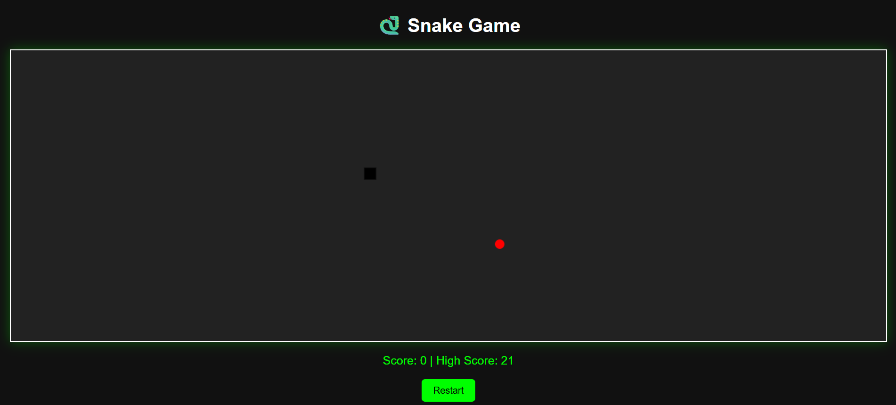

# 🐍 Snake Game

A classic Snake game built using **HTML**, **CSS**, and **JavaScript**. The game is simple, fun, and responsive with features like increasing speed, high score tracking, and a restart button.

## 🔗 Live Demo

👉 [Play the Game]([snakegamebyfaizan.netlify.app](https://688a7b9213409991b0be3932--snakegamebyfaizan.netlify.app/))  


## 🎮 Features

- Real-time snake movement with arrow keys
- Snake grows on eating food
- Speed increases as snake size increases
- Game over detection (wall or self-collision)
- Restart button
- High score saved in local storage
- Visually distinct snake head and body
- Clean, modern UI with white canvas background

## 📸 Screenshot


> Add your `screenshot.png` in the root folder or update this path accordingly.

## 🚀 How to Run

1. Clone the repository or download the ZIP.
2. Open `index.html` in any modern browser (Chrome, Firefox, Edge, etc.).

```bash
git clone https://github.com/yourusername/snake-game.git
cd snake-game
open index.html
snake-game/
├── index.html       # Main HTML file
├── style.css        # Styling
├── script.js        # Game logic
└── screenshot.png   # Optional image for README
